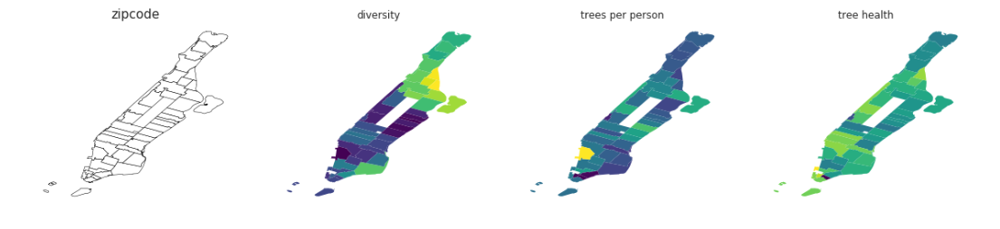

# Midterm Exam, Principles of Urban Informatics course at NYU CUSP by [Federica Bianco](https://github.com/fedhere)

In [this notebook](https://github.com/pmandiola/pui_midterm/blob/master/PUImidterm_pmb434.ipynb) you can find my answer to the exam, for which we had three hours to work on.

## Assessing equity in Manhattan greenery distribution by relating access to greenery to diversity
